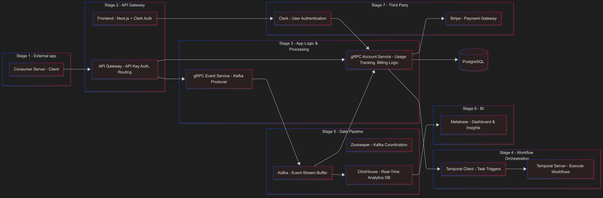
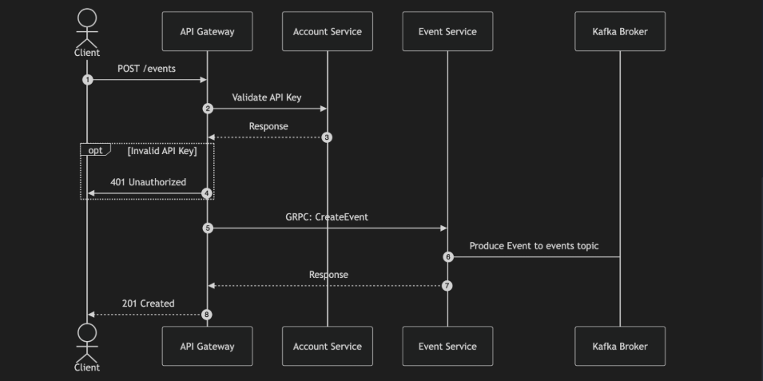

# InsightMesh

**InsightMesh** is a real-time event tracking and analytics platform built to demonstrate a full-stack microservices architecture. Designed for developer-facing platforms, it lets users sign up, receive an API key, and track events — which are analyzed and stored in a cloud-native analytics pipeline.

> 🧑‍💻 This is a professional showcase project — not open source — designed to demonstrate proficiency in microservices, gRPC, message queues, cloud deployment, and real-time analytics.

---

## 🧱 Architecture Overview


Here’s how InsightMesh processes data across distributed services:

### 🧩 Service Architecture (Logical Stages)



### 📜 Sequence Diagram (Event Processing)



---

1. **User signs up** on [`https://insightmesh.site`](https://insightmesh.site) using **Clerk**.

2. Clerk manages user auth and **organization creation**, which is synced with `grpc-account`.

3. User receives an **API key** linked to their organization.

4. They send an event to:

   ```
   POST https://insightmesh.site/api-gateway/api/events
   ```

   ```json
   {
     "type": "example",
     "data": {
       "clicked": true,
       "userAgent": "Mozilla/5.0"
     }
   }
   ```

5. `api-gateway`:

    * Verifies API key using `grpc-account`
    * Forwards the event to `grpc-events`

6. `grpc-events`:

    * Publishes event to **Kafka**

7. **Kafka listeners**:

    * `grpc-account` logs usage to **PostgreSQL** (with org ID & Stripe ID)
    * A dedicated **ClickHouse listener** stores logs in **ClickHouse**

8. **Metabase** runs analytics queries on ClickHouse

9. **Frontend** displays analytics dashboards

---

---

## 🚀 From Idea to Implementation

I built InsightMesh to empower platforms to extract meaningful insights from the events they already generate. Using a developer-centric architecture, I designed a flow where third-party systems can seamlessly route real-time activity data to InsightMesh — without changing their core app behavior.

With a modern stack that includes Temporal workflows, gRPC microservices, Kafka, Prisma, and ClickHouse, the focus was on automation, observability, and developer ergonomics. Every decision — from API key security to billing workflows — was part of a full-stack experience design that prioritizes both performance and clarity.

---

## 🧰 Technical Stack & Development Environment

### Frontend

* **Next.js & TypeScript**: Provides a responsive, high-performance user interface with strong type safety, enhancing user experience and developer productivity.

### Backend & APIs

* **gRPC**: Enables efficient, scalable inter-service communication with high performance and low latency.
* **Kafka + Zookeeper**: Supports real-time streaming and messaging, ensuring reliable, fault-tolerant data integration between components.
* **Temporal**: Manages robust workflow orchestration and automation, ensuring reliable execution and fault-tolerance in complex processes.

### Data & Analytics

* **PostgreSQL**: Stores relational data securely and efficiently, supporting robust transaction handling and consistency.
* **ClickHouse**: Facilitates high-speed analytical queries and real-time data processing, optimizing performance for large datasets.
* **Metabase**: Offers intuitive visualization and analytics capabilities, enabling interactive exploration and informed decision-making.

### DevOps & Deployment

* **Docker**: Ensures consistent and portable application deployment through containerization, enhancing scalability and manageability.
* **PM2**: Manages efficient and reliable process monitoring and auto-restarting, maintaining continuous application availability.

### Authentication & Payments

* **Clerk**: Provides secure, seamless user authentication and session management, ensuring data protection and ease of integration.

* **Stripe**: Facilitates secure and streamlined payment processing, enhancing transactional efficiency and customer trust.

* **Frontend**: Next.js (React), Clerk (Auth + Org), Metabase charts

* **Backend**:

    * gRPC microservices (Node.js + TypeScript)
    * PostgreSQL (via Neon)
    * Kafka + Zookeeper
    * ClickHouse (event logging)
    * Stripe (billing)
    * PM2 (process manager for prod)

* **DevOps**: Docker Compose for local stack

---

## 🗂️ Monorepo Layout

```
apps/
  ├── api-gateway/      # HTTP API layer
  └── front/            # Frontend (Next.js + Clerk + Metabase)

packages/
  ├── grpc-account/     # Account/org service + billing
  ├── grpc-events/      # Event ingestion, Kafka publishing
  └── node-common/      # Shared utils/types/encryption
```

---


## 🔐 API Key Encryption

* Keys generated with format: `sk_xxxxxxxxxxxxxxxx`
* Encrypted using `SECRET_ENCRYPT_KEY` and stored in a `Secret` table
* To decrypt:

```ts
const apiKey = decrypt({
  secretKey: env('SECRET_ENCRYPT_KEY'),
  iv,
  ciphertext,
});
```

---

## ☁️ Cloud & Docker Setup

### ▶️ Local Setup

```bash
docker-compose up --build
```

This starts:

* Kafka + Zookeeper
* ClickHouse + Listener
* Metabase

Then, enter the ClickHouse Docker container:

```bash
docker exec -it clickhouse clickhouse-client
```

Run the following script inside ClickHouse:

```sql
CREATE TABLE kafka_events
(
    id    String,
    appId String,
    type  String,
    data  String
) ENGINE = Kafka
SETTINGS
    kafka_broker_list = 'kafka:9092',
    kafka_topic_list = 'events',
    kafka_group_name = 'clickhouse_events_consumer',
    kafka_format = 'JSONEachRow',
    kafka_num_consumers = 1,
    kafka_max_block_size = 1048576,
    kafka_poll_max_batch_size = 1000,
    kafka_handle_error_mode = 'stream';
```

Prepare `.env` files for:

* `packages/grpc-account/.env`
* `packages/grpc-events/.env`
* `apps/front/.env`

Install dependencies:

```bash
npm install --legacy-peer-deps //it also generate proto automatically
```

Build all apps:

Also generate Prisma clients and apply schema to Postgres:

```bash
cd packages/grpc-account
npm run prisma:generate

cd ../grpc-events
npm run prisma:generate

npm run prisma:push --workspace=packages/grpc-account
```

```bash
npx turbo run build
```

Start services:

```bash
# gRPC Account
PORT=50053 npm run dev --workspace=packages/grpc-account

# gRPC Events
PORT=50052 npm run dev --workspace=packages/grpc-events

# Frontend
npm run dev --workspace=apps/front
```

```bash
docker-compose up --build
```

This starts:

* Kafka + Zookeeper
* ClickHouse + Listener
* Metabase
* All microservices

### 📦 Production (VM)

```bash
# Update & install system dependencies
sudo apt update && sudo apt install -y curl docker.io docker-compose

# Install Node.js 18
curl -fsSL https://deb.nodesource.com/setup_18.x | sudo -E bash -
sudo apt install -y nodejs

# Install global npm tools
sudo npm install -g pm2 dotenv-cli next

# Optional: Fix npm permissions
mkdir ~/.npm-global
npm config set prefix '~/.npm-global'
echo 'export PATH=$HOME/.npm-global/bin:$PATH' >> ~/.profile
source ~/.profile

# Enable Docker
sudo systemctl enable docker
sudo usermod -aG docker $USER
newgrp docker

# Create folders for proto files (if needed)
mkdir -p packages/grpc-account/src/grpc
mkdir -p packages/grpc-events/src/grpc

# Setup environment variables
nano packages/grpc-account/.env
nano packages/grpc-events/.env
nano apps/front/.env

# Start Docker stack
docker-compose up -d

# Start all apps using PM2
pm2 start ecosystem.config.js
```

---

## 📈 Analytics

* All event logs are stored in **ClickHouse**
* Metabase reads from ClickHouse and visualizes usage
* Supports daily/hourly charts, Top events, API usage per org

---

## 🌟 Why This Approach Matters

Every platform generates a large amount of internal activity and behavioral data — InsightMesh taps into that naturally occurring stream of events without disrupting the core application. By simply forwarding the same events that already exist in the platform (clicks, visits, actions, etc.), InsightMesh helps developers and decision-makers harness that data in a meaningful way.

This approach allows teams to:

* Reuse existing app events with zero side effects
* Understand real customer behavior
* Drive admin-level decisions
* Optimize UX, features, and business direction

All without modifying the application logic — just by smartly routing existing events to InsightMesh.

---

## ✅ Goals of this Project

* Real-world event pipeline: collection → validation → usage → analytics
* Demonstrates ability to integrate:

    * gRPC microservices
    * Kafka event streams
    * Stripe billing & Clerk orgs
    * Secure API key management
* Production-ready with Docker & PM2 deployment

---

## 📬 Contact

This is a demonstration project by **Jamal Majadle**.
Reach out for collaboration or opportunities.
